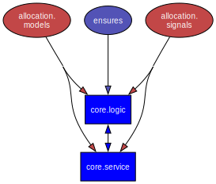

# cosmic-django

[](https://github.com/brunodantas/cosmic-django/actions/workflows/ci.yml)
[](https://github.com/brunodantas/cosmic-django/actions/workflows/test-matrix.yml)
[](https://github.com/brunodantas/cosmic-django/actions/workflows/code-quality.yml)

Applying the concepts of [Cosmic Python](https://www.cosmicpython.com/) to Django.

See blog post: https://brunodantas.github.io/blog/2025/09/12/cosmic-django


## Dependency Graph



Command to generate (from `cosmic` directory):

```bash
uv run pydeps core -o ../dependency_graph.svg
```
